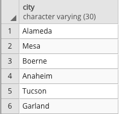
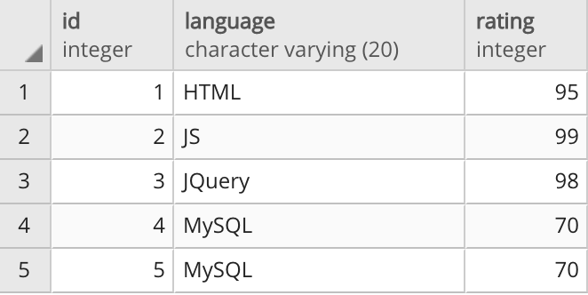

# sql-exploration
A collection of exploratory exercises to improve SQL skills.

## `01-animals_db`

### Create a Database
To create a database in pgAdmin, follow these steps:

1. In the pgAdmin editor, right-click `PostgreSQL 15` on the left-hand side panel.
2. From the menu, hover `Create` to instantiate a new database.
3. Enter `animals_db` as the database name. Make sure the owner is set as the default `postgres`, and then click Save.

### Create a Table
- `01-create_tables.sql` contains a sample table creation script with several different data types.

### Insert Values
- `02-insert_values.sql` contains a sample record insertion script that demonstrates basic data entry.

### Query All Records
- `03-query_all_records.sql` contains the most basic full-table query script.
- `03-query_all_records_results.csv` shows the query results.

### Filtered Query
- `04-filtered_query.sql` contains a query script that retrieves only some fields from records that meet several criteria.
- `04-filtered_query_results.csv` shows the query results.

### Delete, Recreate and Populate Tables
- `05-delete_create_tables_with_primary_keys.sql` contains a script that demonstrates how to drop a table, recreate it with a sequential primary key, and populate it.
- `05-query_all_with_primary_key_results.csv` shows the results of those actions.

### Updating, Deleting and Bulk Importing Data
- `06-dave_query.sql` contains a filtered query script.
- `06-dave_query_results.csv` contains the results of that query.
- `07-update_record.sql` contains a script that demonstrates how to update records that meet particular criteria.
- `07-update_record_query_results.csv` conains the results of a query meant to visualize the effects of the above.
- `08-drop_duplicate.sql` demonstrates deleting a record based on a unique ID.
- `08-drop_duplicate_query_results.csv` conains the results of a query meant to visualize the effects of the above.
- `09-create_table_fauna_vertebrate.sql` creates a new, unpopulated table.
- `10-insert_values_fauna_vertebrate.sql` populates the new table.
---

## `02-city_info`

### Procedure
1. Create a new database in pgAdmin named `city_info`.
    - Corresponding script is titled `01-create_database.sql`.
2. Using the query tool, create an empty table named `cities`. Be sure to match the data types!
    - Corresponding script is titled `02-create_tables.sql`.
3. Insert data into the new table. The result should match the following image.

    
    
    city character varying (30) | state character varying (30) | population integer |
    |----|----|----|
    | Alameda | California | 79177 |
    | Mesa | Arizona | 496401 |
    | Boerne | Texas | 16056 |
    | Anaheim | California | 352497 |
    | Tucson | Arizona | 535677 |
    | Garland | Texas | 238002 |

    - Corresponding script is titled `03-insert_values.sql`. Full-table verification query is provided in `03-query_all_records` results are provided in `03-query_all_records_results.csv`.
    
4. Query the table to recreate the image below.

    
    
    | city character varying (30) |
    |----|
    | Alameda |
    | Mesa |
    | Boerne |
    | Anaheim |
    | Tucson |
    | Garland |

    - Corresponding script is titled `04-city_query.sql`. Results are provided in `04-city_query_results.csv`.
    
### Additional Exploration
1. Filter the table to view only cities in Arizona.
    - Corresponding script is titled `ae-01-arizona_query.sql`. Results are provided in `ae-01-arizona_query_results.csv`.
2. Filter the table to view only cities with a population of less than 100,000.
    - Corresponding script is titled `ae-02-small_cities_query.sql`. Results are provided in `ae-02-small_cities_query_results.csv`.
3. Filter the table to view California cities with a population of less than 100,000.
    - Corresponding script is titled `ae-03-small_cities_california_query.sql`. Results are provided in `ae-03-small_cities_california_query_results.csv`.

#### Notes
* The first and second `Additional Exploration` tasks use a [`WHERE` clause](https://www.tutorialspoint.com/sql/sql-where-clause.htm) to filter the original query.
* The third `Additional Exploration` task uses an [`AND` clause](https://www.tutorialspoint.com/sql/sql-and-or-clauses.htm).
---

## `03-programming_db`

### Procedure
1. Create a new database named `programming_db`.
    - Corresponding script is titled `01-create_database.sql`.

2. Create the `programming_languages` table using the following image.

    

    | id integer | language character varying (20) | rating integer |
    |----|----|----|
    | 1 | HTML | 95 |
    | 2 | JS | 99 |
    | 3 | JQuery | 98 |
    | 4 | MySQL | 70 |
    | 5 | MySQL | 70 |

    - Corresponding script is titled `02-create_tables.sql`. A verification results file can be found under the name `02-create_tables_full_query_results.csv`.

3. Query the table to return the rows containing MySQL, and then delete one of the duplicates.
    - Corresponding script is titled `03-mysql_query_and_cleaning.sql`. Query results can be found in `03-mysql_query_and_cleaning_results.csv`.

4. Insert a few more rows of data for additional programming languages by adding the `language` and `rating` of your choice to the `programming_languages` table.
    - Corresponding script is titled `04-insert_records.sql`. A verification results file can be found under the name `04-insert_records_full_query_results.csv`.

5. Change the name of the JS language to JavaScript.
    - Corresponding script is titled `05-find_and_replace.sql`. A verification results file can be found under the name `05-find_and_replace_full_query_results.csv`.

6. Change the rating for HTML to 90.
    - Corresponding script is titled `06-single_record_change.sql`. A verification results file can be found under the name `06-single_record_change_full_query_results.csv`.

## Additional Exploration
1. Create a Boolean column named `expert` that has a default value of `true` in the `programming_languages` table.
    - Corresponding script is titled `ae-01-create_new_column.sql`. A verification results file can be found under the name `ae-01-create_new_column_full_query_results.csv`.
---

## `04-miscellaneous_db`

### Procedure
1. Open the `soft-attributes.csv` CSV file from the `resources` folder to analyze the data.
    - The `miscellaneous_db` database was created with the script saved in the `01-create_database.sql` file.
2. Using the column headers and data types from the CSV file, write the table schema to create a new table in the `miscellaneous_db` database called `movie_words_comparison`.
    - Corresponding script is titled `02-create_tables.sql`. A verification results file can be found under the name `06-single_record_change_full_query_results.csv`.
3. Import the data from the `soft-attributes.csv` file in the `resources` folder.
    - Data was imported from the `/resources/aoft-attributes.csv` file using the pgAdmin4 import client, but a working import script is included under the name `03-import_soft_attributes.sql`.
4. Create a query that collects all rows where `Home Alone (1990)` is in the `reference_title` column.
    - Corresponding script is titled `04-home_alone_query.sql`. A verification results file can be found under the name `04-home_alone_query_results.csv`.
5. Create a query that collects all rows where the rater is within the 10-15 range.
    - Corresponding script is titled `05-raters_10_to_15_query.sql`. A verification results file can be found under the name `05-raters_10_to_15_query_results.csv`.
6. Create a query that searches for the words `artsy` and `heartfelt` in the `soft_attribute` column.
    - Corresponding script is titled `06-heartfelt_artsy_query.sql`. A verification results file can be found under the name `06-heartfelt_artsy_query_results.csv`.

### Additional Exploration
1. Create a query that will collect all rows with a reference title of `Batman (1989)` and a soft attribute of `scary`.
    - Corresponding script is titled `ae-01-scary_batman_query.sql`. A verification results file can be found under the name `ae-01-scary_batman_query_results.csv`.
2. Create a query that will collect all rows with a rater within the 30-40 range and has a reference title of `Home Alone (1990)` and a soft attribute of `artsy`.
    - Corresponding script is titled `ae-02-raters_30_to_40_artsy_home_alone_query.sql`. A verification results file can be found under the name `ae-02-raters_30_to_40_artsy_home_alone_query_results.csv`.
---

## 05-CRUD
An exploration of CRUD operations (Create, Read, Update, Delete) on the provided data.

### Procedure
1. Create a new database named `Malaysia` in pgAdmin.
2. Create two new tables in the `Malaysia` database by copying the code provided in `schema.sql` into a new query window in pgAdmin.
3. Using the Import/Export tool, import the data from `mys_road_accidents.csv` into the `road_accidents` table, and then import the data from `mys_accidents_by_state.csv` into the `accidents_by_state` table.
4. In the `road_accidents` table, find the row that has a `road_crashes` value of 0 and note:

    * the year
    * the number of `road_deaths`
    * the names of the other two columns have missing data (0 values)
    
You will be able to calculate this missing data from the second table.

5. In the `accidents_by_state` table, delete all rows for years that do not have data missing from the `road_accidents` table.
6. In the `accidents_by_state` table, in a single SQL query, find the [Sum](https://www.w3schools.com/sql/sql_count_avg_sum.asp) of each of the three columns with missing data, as well as `road_deaths`, and rename the summed columns with their original column name using `AS`.

Compare the sum of `road_deaths` from these results with the value from the `road_accidents` table. If they do not match, the other values will also be incorrect.

7. Once the `road_deaths` values match up, note the values for the three columns with missing data, and update the `road_accidents` table with this new information.

### Additional Exploration
1. Delete all rows from `accidents_by_state` and re-import the data from `mys_accidents_by_state.csv`. If you import the data again without deleting the rows, you will have duplicated data.
2. Without deleting any rows, calculate the sum of `road_crashes`, `road_deaths`, `serious_injury`, and `slight_injury` for a subsequent year, and add those values plus the year to the `road_accidents` table.

**Note**: We need to include a value for `_id` as it has been designated the Primary Key and cannot be null, nor can it be a duplicate value of `_id`.
---

# Joining Bird Bands

When information could unintentionally be duplicated, data is often stored in separate tables with reference to an `id`. In the case of the dataset you will explore, most of the unique identifiers are labeled with the word `code`.

In this activity, you will be using joins to learn more about North American bird banding. The example contains data reduced from its original source, so if you would like to explore the data further, click the link in the Reference section.

## Instructions

* Create a new database named `bird_banding_DB`, and create eight new tables with pgAdmin named `bird_bands`, `age`, `band_type`, `bird_status`, `country_state`, `event_type`, `extra_info` and `sex`.

* Copy the code from `schema.sql` to create the tables, and then import the corresponding data from the CSV files with the same names. **Note:** Remember to refresh the database. Newly created tables will not immediately appear.

* Perform joins that will generate the following outputs:

  * Basic Information Table:

  | | band character varying | event_date character varying | species_name character varying | age_description character varying | sex_description character varying |
  |----|----|----|----|----|----|
  | 1 | B06814289038 | 5/22/02 | Warbling Vireo | After Hatching Year | Unknown |
  | 2 | B06834226076 | 2/5/97 | White-eyed Vireo | After Hatching Year | Unknown |
  | 3 | B06834537033 | 9/28/01 | Red-eyed Vireo | After Hatching Year | Unknown |
  | 4 | B06834538078 | 9/6/01 | Red-eyed Vireo | Hatching Year | Unknown |
  | 5 | B06834760300 | 2/8/96 | La Sagra's Flycatcher | After Hatching Year | Unknown |
  | 6 | B06834762078 | 12/8/95 | La Sagra's Flycatcher | Unknown | Unknown |
  | 7 | B06834824074 | 2/9/96 | Yellow-bellied Flycatcher | After Hatching Year | Unknown |
  | 8 | B07033377537 | 2/26/19 | Yellow-bellied Flycatcher | Second Year | Unknown |
  | 9 | B07033378413 | 12/20/18 | Yellow-bellied Flycatcher | Hatching Year | Unknown |
  | 10 | B07033378577 | 12/5/18 | Yellow-bellied Flycatcher | Unknown | Unknown |

  * Extended Information where sex is not unknown: 

  | | band character varying | event_date character varying | species_name character varying | band_type_description character varying | bird_status_description character varying | age_description character varying | sex_description character varying |
  |----|----|----|----|----|----|----|----|
  | 1 | B07324722072 | 6/22/15 | Bahama Swallow | aluminum\butt-end (toll-free /web address) | Normal wild bird. | After Hatching Year | Female |
  | 2 | B07383058128 | 7/15/13 | Black-capped Vireo | aluminum\butt-end (toll-free /web address) | Normal wild bird. | Hatching Year | Male |
  | 3 | B07383058283 | 7/12/13 | Black-capped Vireo | aluminum\butt-end (toll-free /web address) | Normal wild bird. | Hatching Year | Male |
  | 4 | B07404371540 | 3/18/14 | Black-whiskered Vireo | aluminum\butt-end (toll-free /web address) | Normal wild bird. | After Second Year | Female |
  | 5 | B07423509254 | 9/9/11 | Vermilion Flycatcher | aluminum\butt-end toll free | Normal wild bird. | After Hatching Year | Male |
  | 6 | B07463640300 | 4/3/11 | Northern Rough-winged Swallow | aluminum\butt-end (toll-free /web address) | Normal wild bird. | After Hatching Year | Female |
  | 7 | B07463640387 | 4/3/11 | Northern Rough-winged Swallow | aluminum\butt-end (toll-free /web address) | Normal wild bird. | After Hatching Year | Male |
  | 8 | B01924380221 | 2/13/06 | Tropical Kingbird | aluminum\butt end | Normal wild bird. | After Second Year | Male |
  | 9 | B01974875034 | 4/7/00 | Gray Kingbird | aluminum\butt end | Normal wild bird. | After Hatching Year | Female |
  | 10 | B07514549034 | 3/29/11 | Tropical Kingbird | aluminum\butt-end (toll-free /web address) | Normal wild bird. | After Second Year | Male |
  | 11 | B08623850540 | 1/11/75 | Yellow-bellied Flycatcher | aluminum\butt end | Normal wild bird. | Second Year | Male |
  | 12 | B08623850863 | 2/12/75 | Least Flycatcher | aluminum\butt end | Normal wild bird. | After Hatching Year | Female |

  * **Note:** You will need to include a `WHERE` clause on sex_description.

## Reference

Celis-Murillo, A., Malorodova, M., and Nakash, E., 2020, North American Bird Banding Program Dataset 1960-2020 retrieved 2020-06-26: U.S. Geological Survey data release, [https://doi.org/10.5066/P9R1L6Q7](https://doi.org/10.5066/P9R1L6Q7).
Specifically files NABBP_2020_grp_06.csv [reduced in pandas to locations outside of the US and Canada] and NABBP_Lookups_2020.zip