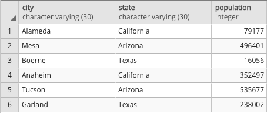

# sql-exploration
A collection of exploratory exercises to improve SQL skills.

## `01-animals_db`

### Create a Database
To create a database in pgAdmin, follow these steps:

1. In the pgAdmin editor, right-click `PostgreSQL 15` on the left-hand side panel.
2. From the menu, hover `Create` to instantiate a new database.
3. Enter `animals_db` as the database name. Make sure the owner is set as the default `postgres`, and then click Save.

### Create a Table
- `01-create_tables.sql` contains a sample table creation script with several different data types.

### Insert Values
- `02-insert_values.sql` contains a sample record insertion script that demonstrates basic data entry.

### Query All Records
- `03-query_all_records.sql` contains the most basic full-table query script.
- `03-query_all_records_results.csv` shows the query results.

### Filtered Query
- `04-filtered_query.sql` contains a query script that retrieves only some fields from records that meet several criteria.
- `04-filtered_query_results.csv` shows the query results.
---

## `02-city_info`

### Procedure
1. Create a new database in pgAdmin named `city_info`.
    - Corresponding script is titled `01-create_database.sql`.
2. Using the query tool, create an empty table named `cities`. Be sure to match the data types!
    - Corresponding script is titled `02-create_tables.sql`.
3. Insert data into the new table. The result should match the following image.

    
    
    city character varying (30) | state character varying (30) | population integer |
    |----|----|----|
    | Alameda | California | 79177 |
    | Mesa | Arizona | 496401 |
    | Boerne | Texas | 16056 |
    | Anaheim | California | 352497 |
    | Tucson | Arizona | 535677 |
    | Garland | Texas | 238002 |

    - Corresponding script is titled `03-insert_values.sql`. Full-table verification query is provided in `03-query_all_records` results are provided in `03-query_all_records_results.csv`.
    
4. Query the table to recreate the image below.

    
    
    | city character varying (30) |
    |----|
    | Alameda |
    | Mesa |
    | Boerne |
    | Anaheim |
    | Tucson |
    | Garland |

    - Corresponding script is titled `04-city_query.sql`. Results are provided in `04-city_query_results.csv`.
    
### Additional Exploration
1. Filter the table to view only cities in Arizona.
    - Corresponding script is titled `ae-01-arizona_query.sql`. Results are provided in `ae-01-arizona_query_results.csv`.
2. Filter the table to view only cities with a population of less than 100,000.
    - Corresponding script is titled `ae-02-small_cities_query.sql`. Results are provided in `ae-02-small_cities_query_results.csv`.
3. Filter the table to view California cities with a population of less than 100,000.
    - Corresponding script is titled `ae-03-small_cities_california_query.sql`. Results are provided in `ae-03-small_cities_california_query_results.csv`.

#### Notes
* The first and second `Additional Exploration` tasks use a [`WHERE` clause](https://www.tutorialspoint.com/sql/sql-where-clause.htm) to filter the original query.
* The third `Additional Exploration` task uses an [`AND` clause](https://www.tutorialspoint.com/sql/sql-and-or-clauses.htm).
---

## `03-programming_db`

### Procedure
1. Create a new database named `programming_db`.
    - Corresponding script is titled `01-create_database.sql`.

2. Create the `programming_languages` table using the following image.

    

    | id integer | language character varying (20) | rating integer |
    |----|----|----|
    | 1 | HTML | 95 |
    | 2 | JS | 99 |
    | 3 | JQuery | 98 |
    | 4 | MySQL | 70 |
    | 5 | MySQL | 70 |

    - Corresponding script is titled `02-create_tables.sql`.

3. Query the table to return the rows containing MySQL, and then delete one of the duplicates.
    - Corresponding script is titled `03-mysql_query_and_cleaning.sql`. Query results can be found in `03-mysql_query_and_cleaning_results.csv`.

4. Insert a few more rows of data for additional programming languages by adding the `language` and `rating` of your choice to the `programming_languages` table.
    - Corresponding script is titled `04-insert_records.sql`.

5. Change the name of the JS language to JavaScript.
    - Corresponding script is titled `05-find_and_replace.sql`.

6. Change the rating for HTML to 90.
    - Corresponding script is titled `06-single_record_change.sql`.

## Additional Exploration
1. Create a Boolean column named `expert` that has a default value of `true` in the `programming_languages` table.
    - Corresponding script is titled `ae-01-create_new_column.sql`.